# StyleGAN Encoder - Pytorch Implementation
| Reference Image  | Latent Optimization  | Gender Transformation  | Pose Transformation  |
|---|---|---|---|
| 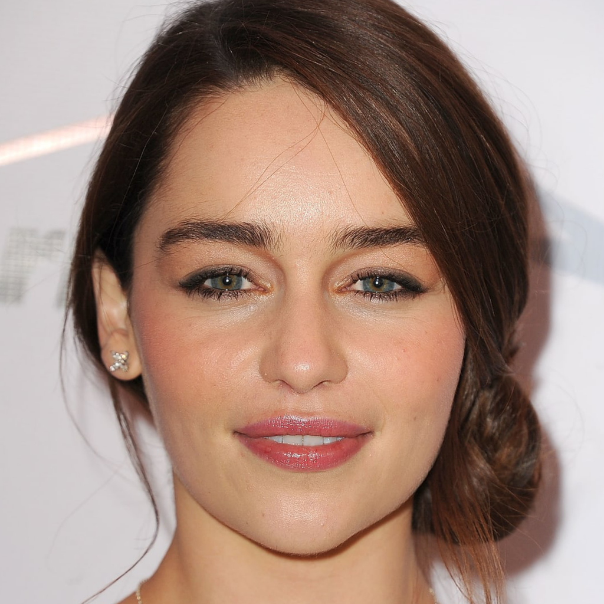  |   |   | 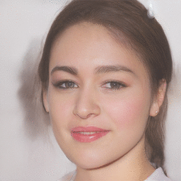  |
|Reference Image | Age Transformation | Gender Transformation | Glasses Transformation |
| 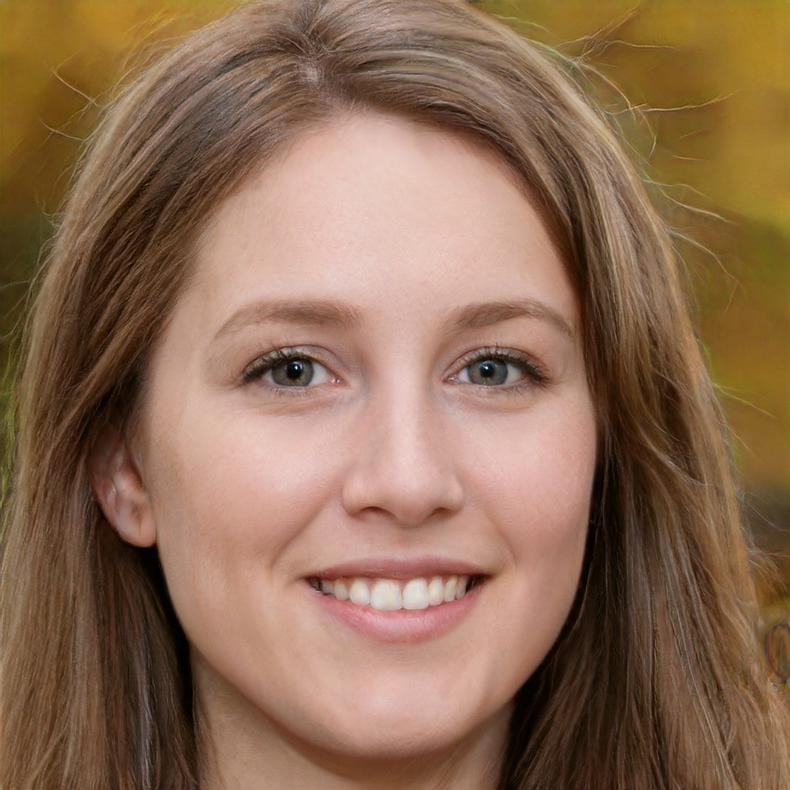  |   |   | 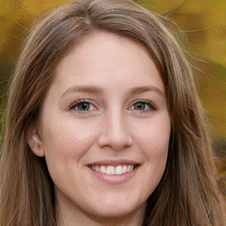  |

## Contents
- [Setup](#setup)
- [Usage](#usage)
- [The Image To Latent Model](#the-image-to-latent-model)
- [Explanations](#explanations)

## Setup
1. Submodule Update
```bash
git submodule update --init --recursive
```

Download the Image To Latent and StyleGAN models from the release on this repo. Place the Image To Latent model at the root of the directory and place the StyleGAN model at ./InterFaceGAN/models/pretrain/.

## Usage
Take an image of a face you'd like to modify and align the face by using an align face script. I'd recommend the one [here](https://github.com/Puzer/stylegan-encoder/blob/master/align_images.py).

Then find the latents for the aligned face by using the encode_image.py script.
```bash
python encode_image.py
  aligned_image.jpg
  dlatents.npy # The filepath to save the latents at.
  --save_optimized_image true
```

The script will generate a numpy array file with the latents that can then be passed to the edit.py script located in the InterFaceGAN repo. Edit an image by running the edit.py script.
```bash
python InterFaceGAN/edit.py
  -m stylegan_ffhq
  -o results
  -b InterFaceGAN/boundaries/stylegan_ffhq_pose_boundary.npy # Use any of the boundaries found in the InterFaceGAN repo.
  -i dlatents.npy
  -s WP
  --steps 20
```
The resulting script will modify the latents and correspondingly the aligned face with the boundary that you select (pose in the above example). It will save all of the transformed images in the -o directory (./results in the above example).

If the resulting image is not to your liking, play around with the vgg16 layer that is used and also modify/add loss functions.

### Encode Image
```bash
python encode_image.py -h

usage: encode_image.py [-h] [--save_optimized_image SAVE_OPTIMIZED_IMAGE]
                       [--optimized_image_path OPTIMIZED_IMAGE_PATH]
                       [--video VIDEO] [--video_path VIDEO_PATH]
                       [--save_frequency SAVE_FREQUENCY]
                       [--iterations ITERATIONS] [--model_type MODEL_TYPE]
                       [--learning_rate LEARNING_RATE] [--vgg_layer VGG_LAYER]
                       [--use_latent_finder USE_LATENT_FINDER]
                       [--image_to_latent_path IMAGE_TO_LATENT_PATH]
                       image_path dlatent_path

Find the latent space representation of an input image.

positional arguments:
  image_path            Filepath of the image to be encoded.
  dlatent_path          Filepath to save the dlatent (WP) at.

optional arguments:
  -h, --help            show this help message and exit
  --save_optimized_image SAVE_OPTIMIZED_IMAGE
                        Whether or not to save the image created with the
                        optimized latents.
  --optimized_image_path OPTIMIZED_IMAGE_PATH
                        The path to save the image created with the optimized
                        latents.
  --video VIDEO         Whether or not to save a video of the encoding
                        process.
  --video_path VIDEO_PATH
                        Where to save the video at.
  --save_frequency SAVE_FREQUENCY
                        How often to save the images to video. Smaller =
                        Faster.
  --iterations ITERATIONS
                        Number of optimizations steps.
  --model_type MODEL_TYPE
                        The model to use from InterFaceGAN repo.
  --learning_rate LEARNING_RATE
                        Learning rate for SGD.
  --vgg_layer VGG_LAYER
                        The VGG network layer number to extract features from.
  --use_latent_finder USE_LATENT_FINDER
                        Whether or not to use a latent finder to find the
                        starting latents to optimize from.
  --image_to_latent_path IMAGE_TO_LATENT_PATH
                        The path to the .pt (Pytorch) latent finder model.


```

## The Image To Latent Model
The process of optimizing the latents with strictly just the features extracted by the VGG16 model can be timely and possibly prone to local minima. To combat this problem, we can use another model thats sole goal is to predict the latents of an image. This gives the latent optimizer model a better initilization point to optimize from and helps reduce the amount of time needed for optimization and the likelyhood of getting stuck in a far away minima.

Here you can see the the images generated with the predicted latents from the Image To Latent Model.
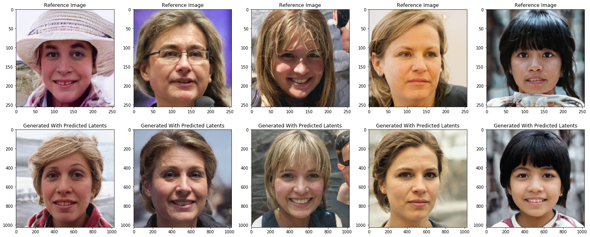

### Usage
The encode_image.py script by default does not use the Image To Latent model, but you can activate it by specifiying the following args when running encode_image.py. Without using an Image To Latent model the encode_image.py script defaults to optimize latents initialized with all zeros.
```bash
python encode_image.py
  aligned_image.jpg
  dlatents.npy
  --use_latent_finder true # Activates model.
  --image_to_latent_path ./image_to_latent.pt # Specifies path to model.
```

### Training
All of the training is located in the [train_image_to_latent_model.ipynb notebook](https://github.com/jacobhallberg/pytorch_stylegan_encoder/blob/master/train_image_to_latent_model.ipynb). To generate a dataset use the following command.
```bash
python InterFaceGAN/generate_data.py
  -m stylegan_ffhq
  -o dataset_directory
  -n 50000
  -s WP
```
This will populate a directory at ./dataset_directory with 50,000 generated faces and a numpy file called wp.npy. You can then load these into the notebook to train a new model. Using more than 50,000 will train a better latent predictor.

## Explanations

### What is a StyleGAN?
[StyleGAN](https://github.com/NVlabs/stylegan) is a NVIDIA based work that enables the generation of high-quality images representing the image dataset that it was trained on with the ability to control aspects of the image synthesis.

### What are latent codes (latents)?
Typically with generative models the latent code acts as input into the generative model and modifying the latent code modifies the output image. StyleGAN uses latent codes, but applies a non-linear transformation to the input latent codes z, creating a learned latent space W which governs the features of the generated output images.

If you can control the latent space you can control the features of the generated output image. This is the underlying principal that is used to transform faces in this repo.

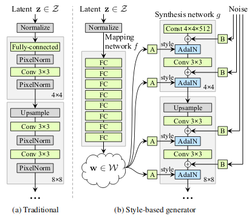

###### Image from [StyleGan Paper](https://arxiv.org/pdf/1812.04948.pdf) figure 1. 

### What are the benifits of using a mapping network to create a latent space?
In traditional GAN architecture, the input vector z is sampled from a uniform gaussian distribution. The issue with sampling from a uniform guassian distribution and then generating images from the sampled vectors z, is that if the features of your data distrubtion do not follow a guassian distribution the sampled vectors z contain features that never existed in your data distrubtion. This causes the generator to generate images with features never seen in your data distribution.

|  Actual Feature Distribution | Gaussian Feature Distribution  |
|---|---|
| 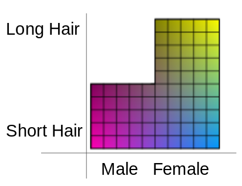  | 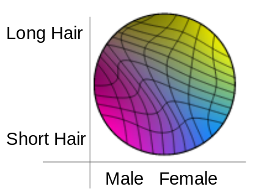  |

###### Latent colored blocks from [StyleGan Paper](https://arxiv.org/pdf/1812.04948.pdf) figure 6. 


For example, above shows the actual feature distribution of some data and the feature distribtuion of data sampled from a uniform gaussian distribution. In the above case, the actual distribution of data does not contain males with long hair, but the sampled vector z from a gaussian distribution will generate images of males with long hair.

This is where StyleGAN shines. The mapping network doesn't have to map the vectors z into a gaussian distribution because the mapping network is learned through the data itself. Meaning the mapping network is able to produce a latent space W that can better represent the features seen in the data by taking in a uniform distribution of data z and mapping it to a distribution that contains gaps w.

|  Actual Feature Distribution | Mapping Network Feature Distribution  |
|---|---|
|   |   |

Additionally, with StyleGAN the image creation starts from a constant vector that is optimized during the training process. This constant vector acts as a seed for the GAN and the mapped vectors w are passed into the convolutional layers within the GAN through adaptive instance normalization (AdaIN). This takes away the responsiblity of the GAN having to learn how to warp a uniform distribution into one that represents the data and allows it to simply focus on generating images. All of these aspects together allow for very high quality image generation.


### How do latents (latent space) make it easier to modify an image?
A vector within the latent space W from the mapping network represents a fixed image with fixed features. If you take that vector and shift it across an axis, you modify the features of the image. If modified in soley the direction of a specific feature within the latent space W, everything about the image stays the same besides the feature that the vector (latent) is being shifted towards. 

To make this more clear, imagine a vector that represents a male with short hair within the latent space W. If you'd like to keep the short hair, but generate a female version of a male, all you need to do is shift the vector in the direction of female without changing the direction of the length of hair.

|  Male with Short Hair | Male Transformed To Female with Short Hair  |
|---|---|
| 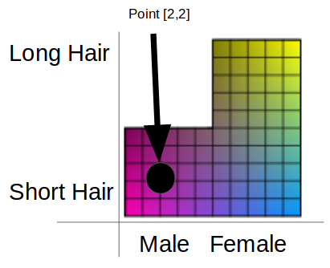  | 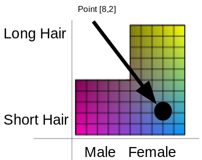  |

This can be done with any discoverable feature within the latent space. For example, age and gender.

| Reference Image  | Younger  | Older  | Transformation  |
|---|---|---|---|
|   | 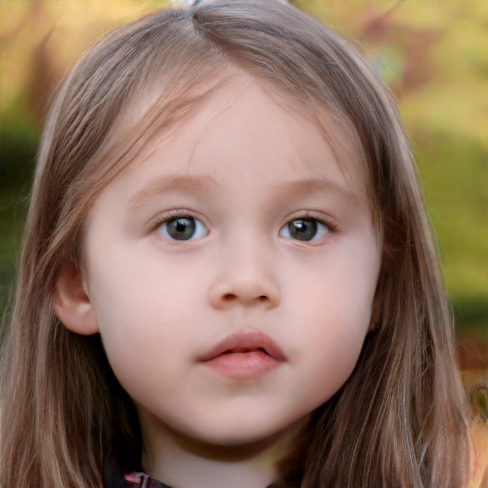  |   |   |

| Reference Image  | More Feminine  | More Masculine  | Transformation  |
|---|---|---|---|
|   |   | 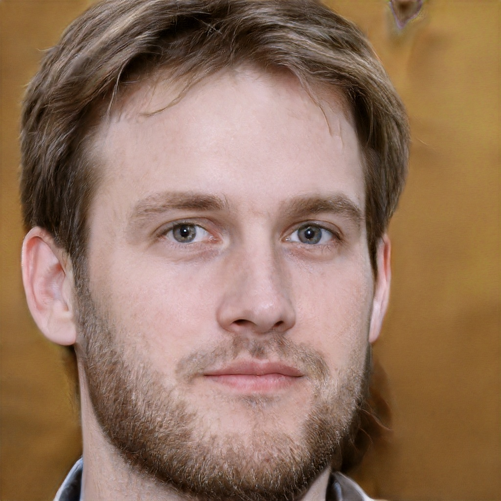  |   |

What you may notice from these transformations is that features are not completely independent. When changing one feature you often change many other dependent features.

### Okay, we have a query image we want to modify. How do we get the latent representation of that query image so that we can modify it?
The first step that you may think of is to just compare a random generated image from the GAN with your query image with a loss function like mean squared error (MSE). Afterwards, use gradient decent to optimize the latent values of the random image until the generated image matches your query image.

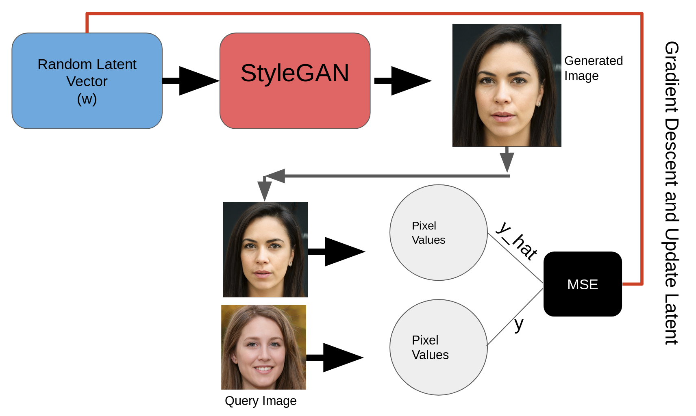

The issue with this is that it turns out to be really difficult to optimize from pixel differences between images without a specialised loss function.

To get around this issue, instead of comparing pixel-wise you can compare feature-wise by extracting the features of both images through a pretrained feature extractor like VGG16 and forgoing the use of the final fully-connected classification layers. Featurewise optimization works much better in practice with simple loss functions like MSE.

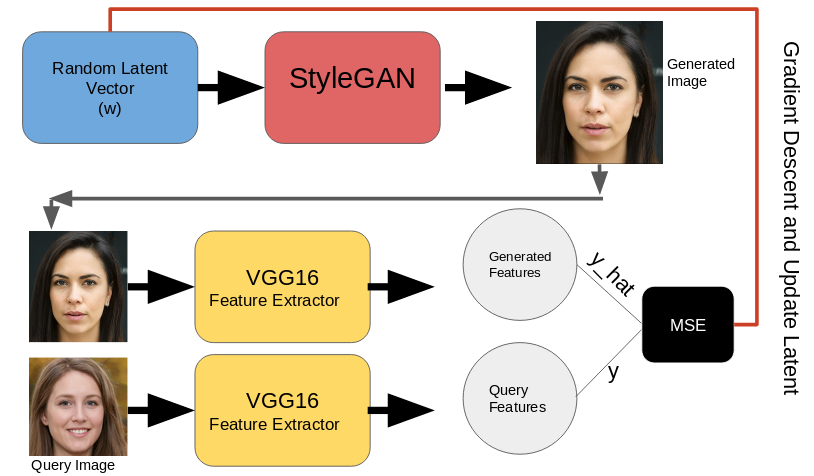

What if instead of a random latent vector as a starting point, we could speed up the optimization process by making a really good guess as to what the query image's latent vector is? This is where a machine learning model called the Image To Latent model comes in. I've talked about it briefly [here](#the-image-to-latent-model)

### How do we discover features within a latent space to modify latent representations?
Simply put, one can use support vector machines or other classifiers to discover a seperating hyperplane that within the latent space seperates the features of interest from other features. To edit the face you then can take the normal of the hyperplane and travel in the direction of the normal. This in returns modifies the latent code of the query image and in return modifies the generated image. 

This is all talked about [here](https://github.com/ShenYujun/InterFaceGAN).

The purpose of this reposity is to create the latent space representation of a query image and not the editing as the editing is a relatively simple process.
